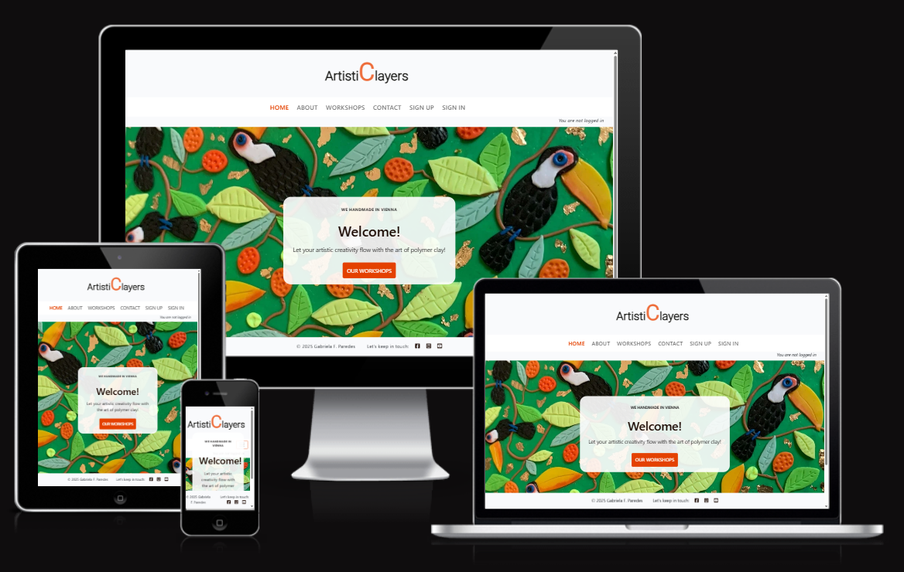

# ArtistiClayers Workshops

(Developer: Gabriela Fabiola Paredes Rojas)

**Welcome to the ArtistiClayers Polymer Clay Workshops!**

+ The site can be accessed via this [link](https://paredesgab.github.io/PP2-the-cosmic-match-memory-game/)

---
## Project Goals

### User Goals

+ 

### Developer Goals

+ 
  
---
## User Experience

### Target audience

+ 

### User expectations

+ 

### User stories

+ **As a first-time user, I want to:**

  + 

+ **As a returning user, I want to:**

  + 

+ **As the site ownser, I want:**

  + 

### Agile Methods

---
## Entity Relationship Diagram (ERD)

---
## Features 

### Home Page

+ 

---
## Features left to implement

- 

---
## Design

### Color scheme

**Main color scheme**

- 

**Secondary color scheme**

- 

### Typography

- 

---
## Wireframes

#### Mobile

- [Mobile: Home menu page](documentation/wireframes/main-page-mobile.png)
- [Mobile: Games indications page](documentation/wireframes/game-instructions-mobile.png)
- [Mobile: Memory board game page](documentation/wireframes/memory-board-game-mobile.png)
- [Mobile: Congratulations page](documentation/wireframes/congratulations-mobile.png)

#### Tablets

- [Tablet: Home menu page](documentation/wireframes/main-page-tablet.png)
- [Tablet: Games indications page](documentation/wireframes/game-instructions-tablet.png)
- [Tablet: Memory board game page](documentation/wireframes/memory-board-game-tablet.png)
- [Tablet: Congratulations page](documentation/wireframes/congratulations-tablet.png)

#### Laptops/Desktop

- [Laptops: Home menu page](documentation/wireframes/main-page-laptops-up.png)
- [Laptops: Games indications page](documentation/wireframes/game-instructions-laptops-up.png)
- [Laptops: Memory board game page](documentation/wireframes/memory-board-game-laptops-up.png)
- [Laptops: Congratulations page](documentation/wireframes/congratulations-laptops-up.png)

---
## Technologies used
- [HTML](https://developer.mozilla.org/en-US/docs/Web/HTML)
- [CSS](https://developer.mozilla.org/en-US/docs/Web/CSS)
- [JavaScript](https://developer.mozilla.org/en-US/docs/Web/JavaScript)
- [GitHub](https://github.com/): to store the repository, bug track and see the deployed version.
- [Balsamiq](https://balsamiq.com/): to create the wireframes.
- [Google Fonts](https://fonts.google.com/): to import the Rajdhani and Roboto family fonts.
- [TinyPNG](https://tinypng.com/): to compress the images.
- [Flaticon](https://www.flaticon.com/): source of the memory card images.
- [Favicon.io](https://favicon.io/): source of the favicon images.
- [Am I responsive?](https://ui.dev/amiresponsive): to generate the responsive mockup image.
- [MDN Web Docs](https://developer.mozilla.org/en-US/): resource to check CSS properties and javascript syntax and definition descriptions.
- [Color-hex](https://www.color-hex.com/): to get the rgb color information.
- [Chrome DevTools](https://developer.chrome.com/docs/devtools?hl=de) and its open source [Lighthouse](https://developer.chrome.com/docs/lighthouse?hl=de).
-  [W3C HTML](https://validator.w3.org/) and [W3C CSS](https://jigsaw.w3.org/css-validator/) Validation Services. 
- [JSHint](https://jshint.com/): to detect errors and potential problems in the JavaScript code.
- [WAVE](https://wave.webaim.org/): to test accessibility.
- [DeepL Write](https://www.deepl.com/en/write): to spot spelling mistakes in the text. 

---
## Libraries and Framework

---
## Django Packages

---
## Testing

### Validation
- In this section, the HTML and CSS codes were checked for compliance with industry standards. This was done using the W3C Markup Validation Service for HTML and CSS respectively, using the code from both: the working environment and the the deployed version.

- The result in both reports: no errors were returned.

#### HTML Validation

#### CSS Validator

#### JSHint

+ There were no errors found in the javascript code using the JS Hint Validator. 
+ There was one warning and a message of unused variables. This is documented in the "Bugs" section below.

### Accessibility 

Accessibility was tested using the Web Accessibility Evaluation Tool (WAVE report below), and no errors were reported. 

### LightHouse report

Lighthouse tool from Devtools was used to confirm that the website is performing well, is accessible and the colors and fonts chosen are readable.

### Responsiveness

- The website was checked across devices using the chrome extension [Responsive Viewer](https://chromewebstore.google.com/detail/responsive-viewer/inmopeiepgfljkpkidclfgbgbmfcennb?hl=en). 

- In addition, it was manually checked in the following devices:
  - Huawei Y9 Prime 2019
  - Iphone XR
  - Iphone 15 pro
  - Samsung Galaxy S8

### Automated Testing

### Manual Testing

| Feature | Action | Expected result | Tested | Passed | Observations |
| --- | --- | --- | --- | --- | --- |
| **Home Menu Page** | | | | | |
| Header | Game name display | The title is centered and positioned as the topmost element on the page and it is readable | Yes | Yes | - |- |
| Play Game! button | Click on the Play Game! button | Redirects to the Memory Board Game page | Yes | Yes | - |
| Play Instructions button | Click on the Play Instructions button | Redirects to the Game Indications page | Yes | Yes | - |
| Both Home menu buttons | Hover over them | The buttons will rotate slightly and change colors to a gradient of blue and purple | Yes | Yes | 
| Both Home menu buttons | Buttons displayed | The buttons are centered one of top of the other with a consisting style, and they are readable | Yes | Yes | 
| **Game Indications Page** | | | | | |
| Header | Game name display | The title is centered and positioned as the topmost element on the page and it is readable | Yes | Yes | - |- |
| Game indications text | Text display| The paragraph stands out, the content is justified with no spelling mistakes | Yes | Yes | - |
| Images | Images display | The images are loading correctly, they have the same style and dimensions, and are located  below the text| Yes | Yes | - |
| Home Menu button | Click on the Home Menu button | Redirects to the Home Menu page | Yes | Yes | - |
| **Memory Board Game Page** | | | | | |
| Header | Game name display | The title is centered and positioned as the topmost element on the page and it is readable | Yes | Yes | - |- |
| Game Board | Game board display | It stands out and it is centered | Yes | Yes | - |
| Memory cards | Cards display | They have identical dimensions and are arranged in a grid layout. Initially, they appear "closed" with a white background. A hover effect is applied, and the cursor changes to indicate that they are clickable.| Yes | Yes | - |
| Game logic | Game logic | The images are revealed only when clicked. Once a card is clicked, it becomes disabled and cannot be clicked again. After the user clicks two cards, they are re-enabled for further interactions. Each time the user clicks two cards, the "moves" count increases by 1. However, the "score" only increases by 100 when a match is made. The player wins once their score reaches 800 | Yes | Yes | - |
| Restart Game button | Restarts the game | It restarst the game at any time | Yes | Yes | - |
| Restart Game button | Hover over them | The button will rotate slightly and change colors to a gradient of blue and purple | Yes | Yes | - |
| **Game Finished Congratulations Page** | | | | | |
| Header | Game name display | The title is centered and positioned as the topmost element on the page and it is readable | Yes | Yes | - |- |
| Game Finished - Congratulations Page | Page displays | This page appears 4s after the player has won | Yes | Yes | - |
| Congratulations text | Text display | The paragraph stands out, the content is centered with no spelling mistakes | Yes | Yes | - |
| Home Menu button | Click on the Home Menu button | edirects to the Home Menu page | Yes | Yes | - |
| Play Again! button | Click on the Play Again! button | Redirects to the Memory Board Game page | Yes | Yes | - |
| Both buttons | Hover over them | The buttons will rotate slightly and change colors to a gradient of blue and purple | Yes | Yes | 
| Both buttons | Buttons displayed | The buttons are centered one of top of the other with a consisting style, and they are readable | Yes | Yes | 

---
## Browser compatibility

The website was tested on the following browsers:
- Google Chrome
- Firefox
- Microsof Edge

---
## Bugs
+ ### Solved bugs
  1. The W3C Markup validation detected the below error in the HTML code:
  
        - Solution: this mistake was spotted and corrected. 

  2. The W3C Markup validation detected the below warnings in the HTML code:
    
      - Solution: To enhance the HTML syntax, a hidden H2 heading was added to each section without an existing heading.

  3. JSHint showed the following warning:
    
      - Solution: Although the original code was functioning correctly, the event listener logic was updated to avoid any potentially confusing semantics. A separate click handler function was created. This change ensures the correct card index is captured using a closure for the handleCardFlip function.

+ ### Unfixed bugs

  1. JSHint showed the following warning:

    
    
    - As described in the "Features left to implement" section, due to time constraints, I used onclick in all buttons of the HTML document for faster implementation. However, I recognize that mixing structure (HTML) with functionality (JS) is not best practice, as it can make the code harder to maintain and does not facilitate collaboration in team environments. After the project is graded, I plan to refactor the code by removing inline onclick attributes, and instead handling events via JavaScript by adding event listeners, ensuring better separation of concerns and improving maintainability.
  
---
## Deployment

The website has been deployed to GitHub pages following these steps:

1. In the GitHub repository for The Cosmic Match Memory Game [GitHub repository](https://github.com/ParedesGab/PP2-the-cosmic-match-memory-game), select the "Settings" tab.

2. Click on "Pages" from the field "Code and automation" (on the left), and select the below settings:
    - Source: deploy from a branch.
    - Branch: main.
    - click "Save".

3. Select the "Code" tab and refresh the page. 

4. On the right side of the page, a "Deployments" section has been activated indicating a successful deployment. 

5. The live link can be accessed [here](https://paredesgab.github.io/PP2-the-cosmic-match-memory-game/).

## Local Deployment

### Forking

To have a copy of the project in your repositories:
1. Log in or sign up to GitHub.
3. Navigate to the [project repository](https://github.com/ParedesGab/PP2-the-cosmic-match-memory-game).
4. In the top right corner, click the "Fork" button.
5. A new page titled "Create a new fork" will appear. Optionally, you can edit the repository name.
6. At the bottom of the page, click "Create fork."

### Cloning

1. Log in or sign up to GitHub.
2. Go to the [project repository](https://github.com/ParedesGab/PP2-the-cosmic-match-memory-game).
3. Click the green button "Code" and choose your preferred cloning method (for example: HTTPS, SSH, or GitHub CLI) and copy the provided url.
4. Open the terminal in your preferred code editor and change the current working directory to the one where you want the cloned directory
5. Run git clone in the terminal, paste the copied link, and press Enter.

---
## Requirements

---
## Cloudinary

---
## Credits 

### Content 

- The Code institute ci-full-template was used to create the GitHub repository of the Cosmic Match Memory Game website.

- [W3 Schools](https://www.w3schools.com/jsref/met_win_settimeout.asp) showed me how to 

### Media
  
- The universe background image is from [Federico Beccari](https://unsplash.com/de/@federize?utm_content=creditCopyText&utm_medium=referral&utm_source=unsplash).

## Acknowledgments

- My sincere gratitude to 